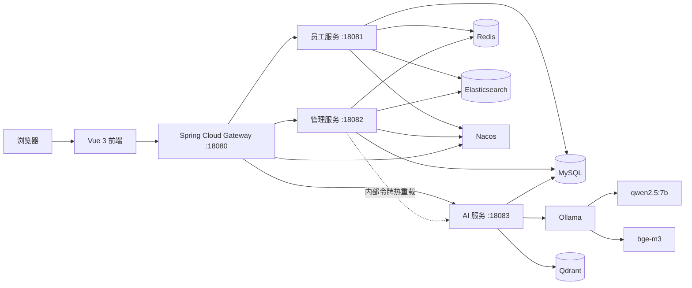

# Nexus Office

Nexus Office 是一个前后端分离的 OA 办公系统，包含员工端、管理端、网关和独立 AI 办公助手。项目以本地开发和个人作品展示为目标，AI 模块使用 Spring AI、Ollama 和 Qdrant 实现混合检索 RAG。

## 核心能力

- 员工登录、个人信息、密码修改、签到、签到记录和请假申请。
- 管理员登录、员工/部门/职务管理、考勤审批、统计和知识库管理。
- Spring Cloud Gateway 统一转发员工、管理和 AI API，AI 服务通过网关侧 LoadBalancer 接入。
- Redis维护员工和管理员在线令牌，退出后令牌立即失效。
- Elasticsearch保存和查询考勤数据。
- 管理端维护 MySQL `kb_doc`，修改后可热重载 AI 知识库。
- AI 支持 SSE流式回答、连续追问、会话过期和资源清理。
- `bge-m3 + Qdrant` 语义检索与关键词检索融合，Qdrant不可用时自动降级。
- FRP只暴露前端和网关，不直接暴露数据库、Ollama、Qdrant或内部服务。

## 系统架构



AI 问答流程：

```text
员工问题
  -> bge-m3 生成 1024 维向量
  -> Qdrant语义检索 + 本地关键词检索
  -> 融合排序并读取 MySQL知识
  -> 注入 qwen2.5:7b 提示词
  -> SSE流式返回答案
```

## 技术栈

| 层级 | 技术 |
|---|---|
| 前端 | Vue 3.5、TypeScript、Vite 6、Element Plus、Pinia、Axios、ECharts |
| 网关/业务服务 | Java 21、Spring Boot 2.7.18、Spring Cloud 2021、Spring Cloud Alibaba、Nacos |
| 数据访问 | MySQL 8、MyBatis、Druid、PageHelper |
| 缓存与检索 | Redis、Elasticsearch 7.13 |
| AI 服务 | Spring Boot 3.5.16、Spring AI 1.1.8、Reactor SSE |
| 本地模型 | Ollama、qwen2.5:7b、bge-m3 |
| 向量数据库 | Qdrant 1.18.3（Docker） |
| 远程演示 | FRP |

AI 服务独立于后端父工程，是因为 Spring AI 1.1需要 Spring Boot 3.x，而原有微服务使用 Spring Boot 2.7。

## 项目结构

```text
nexus-office/
├─ frontend/                                  Vue前端
├─ Nacos-SpringBoot-oa3/backend/
│  ├─ gateway/                                API网关
│  ├─ OA-2/                                   员工服务
│  ├─ OA-7/                                   管理服务
│  ├─ oa-ai-service/                          Spring AI服务
│  └─ day.sql                                 数据库脚本
└─ scripts/                                   启动、停止、状态和FRP文档
```

## 本地依赖与端口

| 端口 | 服务 |
|---:|---|
| 3306 | MySQL |
| 6379 | Redis |
| 6333/6334 | Qdrant HTTP/gRPC |
| 8848 | Nacos |
| 9200 | Elasticsearch |
| 11434 | Ollama |
| 5173 | 前端 |
| 18080 | 网关 |
| 18081 | 员工服务 |
| 18082 | 管理服务 |
| 18083 | AI 服务 |

## 环境变量

必须在操作系统或 IDE 中设置：

```text
OA_DB_PASSWORD
OA_INTERNAL_TOKEN
```

三个后端服务必须使用相同的 `OA_INTERNAL_TOKEN`。参考 [backend/.env.example](Nacos-SpringBoot-oa3/backend/.env.example)，不要提交真实值。

AI 服务还支持这些可选变量：

```text
OA_DB_URL
OA_DB_USERNAME
OA_AI_SERVICE_URI
OA_AI_INSTANCE_1_URI
OLLAMA_BASE_URL
OLLAMA_CHAT_MODEL
OLLAMA_EMBEDDING_MODEL
QDRANT_HOST
QDRANT_GRPC_PORT
QDRANT_COLLECTION
OA_EMP_SERVICE_URL
```

`OA_AI_SERVICE_URI` 默认是 `lb://oa-ai-service`，网关会从 simple discovery 的 `oa-ai-service` 实例列表中负载均衡转发。默认实例为 `OA_AI_INSTANCE_1_URI=http://localhost:18083`。如需多实例，可在 `gateway/src/main/resources/application.yml` 的 `spring.cloud.discovery.client.simple.instances.oa-ai-service` 下继续增加 `uri`，或将 `OA_AI_SERVICE_URI` 指向 Nginx、云负载均衡等外部入口。

## 构建

业务后端：

```powershell
cd D:\nexus-office\Nacos-SpringBoot-oa3\backend
mvn package
```

AI 服务：

```powershell
cd D:\nexus-office\Nacos-SpringBoot-oa3\backend\oa-ai-service
mvn package
```

前端：

```powershell
cd D:\nexus-office\frontend
npm install
npm run build
```

## 启动

使用 IDEA 时建议顺序：

```text
MySQL / Redis / Nacos / Elasticsearch
Docker Desktop / nexus-qdrant
Ollama
OA-2
OA-7
oa-ai-service
gateway
frontend
frpc（需要公网演示时）
```

也可以使用脚本：

```powershell
powershell -ExecutionPolicy Bypass -File D:\nexus-office\scripts\start-oa-demo.ps1
powershell -ExecutionPolicy Bypass -File D:\nexus-office\scripts\status-oa-demo.ps1
```

详细说明见 [演示启动文档](scripts/README-OA-DEMO.md)。

## 测试

普通 AI 测试：

```powershell
cd D:\nexus-office\Nacos-SpringBoot-oa3\backend\oa-ai-service
mvn test
```

真实 RAG 集成测试（需要 MySQL、Ollama、Qdrant）：

```powershell
mvn -Dtest=LiveRagAcceptanceIT test
```

验收集位于：

- `oa-ai-service/src/test/resources/rag-acceptance-cases.json`
- `oa-ai-service/src/test/java/com/oa/ai/service/LiveRagAcceptanceIT.java`

最终验收结果：

- 业务后端 Reactor构建成功。
- AI普通测试 15项通过。
- 真实 RAG集成测试 3项通过，覆盖 8条检索用例。
- 前端类型检查和生产构建成功。
- 公网员工登录、语义问答、SSE、退出失效通过。
- 公网管理员登录、知识库热重载、退出失效通过。
- Qdrant停止时关键词降级通过，恢复后向量重载为 22条。

## FRP边界

```text
公网 18091 -> 本机前端 5173
公网 18092 -> 本机网关 18080
```

AI 请求由网关转发到 18083。不要直接映射 18081、18082、18083、6333、6334、11434、3306、6379或8848。

## 已知限制

- 项目定位为本地开发和作品展示，不是多机生产集群。
- Spring AI 1.1.8使用 Qdrant Java Client 1.13.0，连接 Qdrant Server 1.18.3时会打印版本兼容 WARN；当前建库、写入、过滤、清理和查询均已验收通过。
- 向量相似度阈值 `0.60` 基于当前知识和验收集校准，扩大知识库后应重新评估。
- 前端构建存在大体积 chunk警告，当前不影响功能，后续可通过手动分包优化。

## 简历描述参考

- 基于 Spring Cloud、Vue 3和 MySQL实现前后端分离 OA系统，覆盖员工、组织、考勤、请假和管理流程。
- 将 Spring AI 1.1以独立 Spring Boot 3服务接入原有 Boot 2.7微服务体系，通过网关完成异构服务整合。
- 使用 Ollama `bge-m3`、Qdrant和 `qwen2.5:7b` 实现混合检索 RAG、SSE流式回答、知识库热重载和故障降级。
- 使用 Redis令牌实现员工/管理员会话管理，并通过内部令牌保护跨服务鉴权和知识库重载接口。
